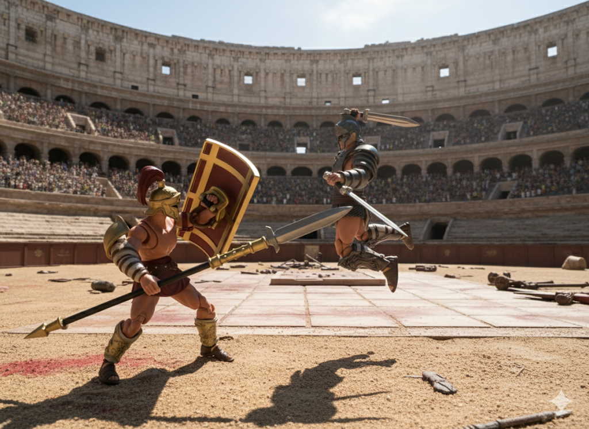

Pow pow pow! That was the noise I made playing with action figures as a kid. In this blog, I'll attempt to write a short story action fight scene between two gladiators. 

The champ walks in with heavy vicious footsteps. With every step, you can see the sand lift off his sandals. His golden breast plate shines off the beaming sun as he steps from the shadow onto the arena. He pauses, gazes at the crowd with confidence, and then he yells his name, "Orooculus!" He continues, "I'll dismantle and behead any challenger who dares to face me!" He pounds his spear heavily onto his large rectangular shield while chanting "Ahoo, Ahoo, Ahoo!"

Slowly, a challenger steps out from the shadow onto the arena standing exactly where the sun and the shadow meets. Orooculus yells across the arena, "State your name soldier!" The challenger, holding his helm at the side of his hip, slowly gazes around the stadium, looking left to right, and then stared into Orooculus's soul. With a calm, but loud voice, he says, "Maximillian Atrocies. I'm a father, husband, and a son. I serve no man, I fight for myself now, and I fight for freedom." Orooculus laughed scoffingly and then replies with cold rage, "Freedom you shall have, death!" 

Maximillian, puts on his silver helm. His plain silver breast plate and shin armor glitering in the sun. Immediately, Maximillian sets his eye on Orooculus, dashes forward and starts sprinting with both of his sword swinging from side to side. Orooculus see's how quick he is, and quickly states "he's fast, I need to close in on him or he'll strike first." Orooculust lift up his spear over his head and hurls it as quick and precise as he can. Maximillian closing the distance quick was already too close that the spear was over-thrown past him. Maximillian, with one stomp from the ground glides onto the air with both of his sword in the air above his head, comes flying down slashing heavily at Orooculus's shield. 

To be continue...