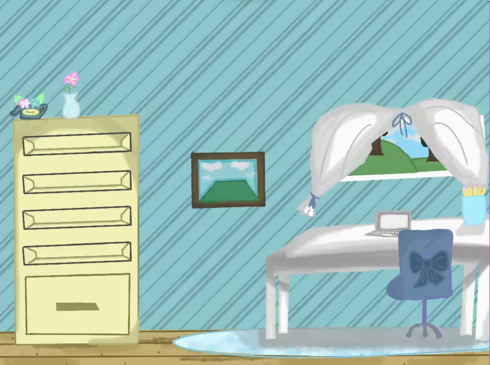

<h2>Clueless But Caring: How a Digital-Art Rookie Dad Helped His Daughter Level Up Her Drawing Skills</h2>

**Intro:**
When it comes to digital art, I’ll be the first to admit I have no idea what I’m doing. What I do know is how much my daughter loves drawing and how important it is to support her passions. Recently, we took on a new challenge together, learning digital art side by side.

**The Video Experience:**
In my latest [YouTube video, “Clueless But Caring Dad: Daughter Levels Up Her Drawing Skills!”](https://www.youtube.com/watch?v=V7c51qSU1Uk), I share a candid look into our little art adventure. My daughter has been getting into digital drawing lately, and to help her along, we found a fantastic Procreate tutorial for kids on YouTube (seriously, check out [Procreate for Kids Tutorial – All About LAYERS!](https://www.youtube.com/watch?v=aGIqfmGh4go&t=23s) if your kid is interested in Procreate). We sat down together, followed along, and learned about layers, which are one of the most important tools for digital artists.

**Learning Together:**
Let me be real, there were moments of frustration, especially when things didn’t look quite right. I was right there beside her, encouraging her to keep trying. As someone totally new to art, I couldn’t offer any expert tips. I could offer support, patience, and a cheering section, which is what mattered most.

Watching my daughter’s creativity come alive was incredible. She stuck with it, practiced the new techniques, and felt proud of what she created. This experience was a perfect reminder that you don’t have to be an expert to help your kids learn. Sometimes, just being present and supportive is the best thing you can do.

**For Fellow Parents:**
If you’re a parent, clueless or not, learning alongside your kids, I want to hear from you! What have you tried together? Do you have any favorite resources, tutorials, or tips? Drop a comment, share your stories, and let’s encourage each other.