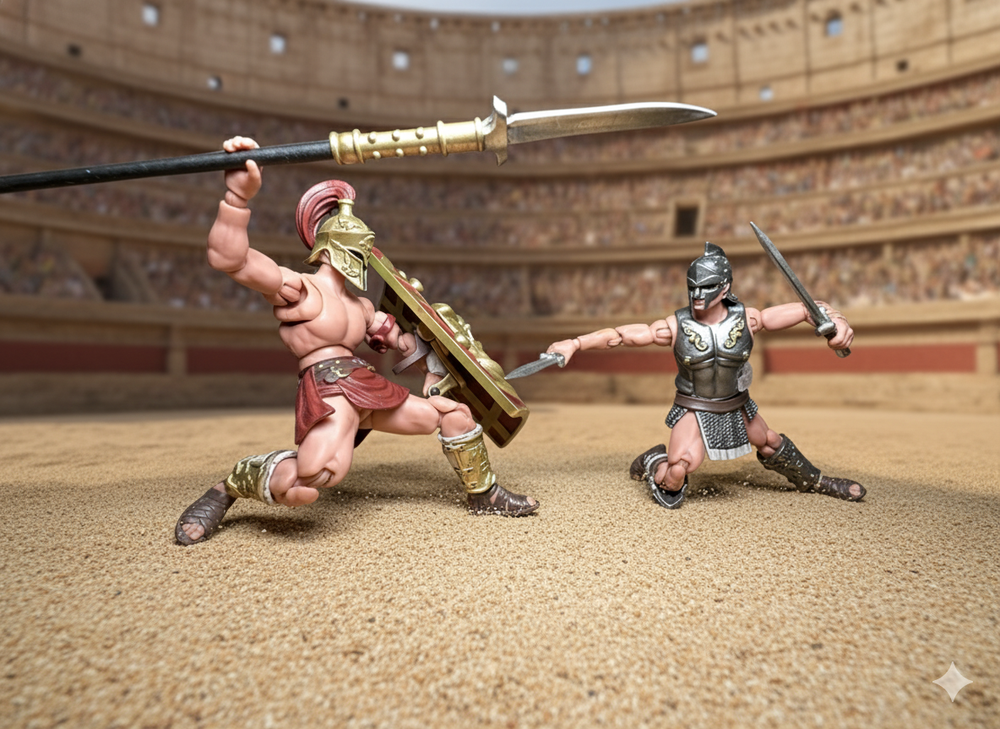
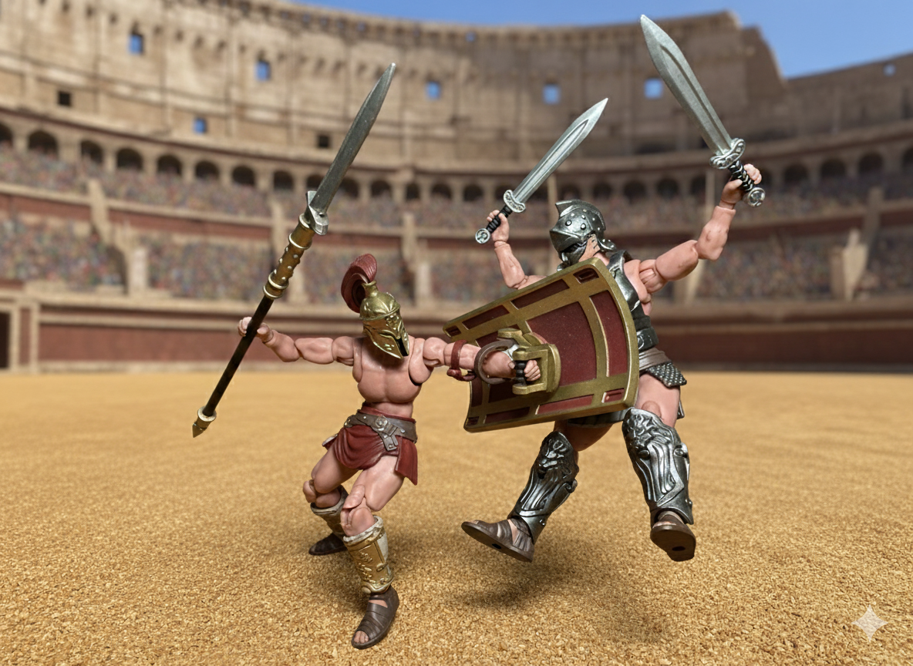
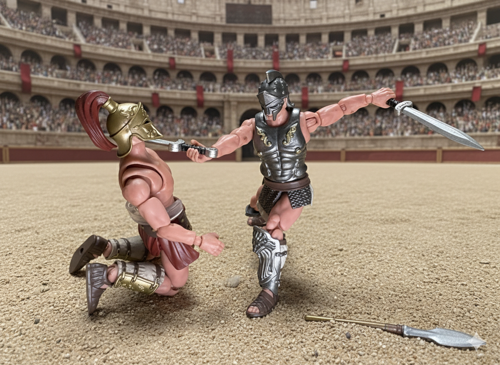

Orooculus dashes back two steps, pointing his spear toward Maximillian, hoping that the extension and space he just created are enough to separate them. Before Orooculus has time to think of his next move, Maximillian dashes forward, slicing both of his swords one at a time toward Orooculus’s legs. Orooculus quickly blocks the attack by squatting lower with his shield. He swings his spear ferociously from behind the shield, thinking that Maximillian won’t see it coming, only to strike nothing but air.

Maximillian has already leaped, front-flipping over and landing behind Orooculus. He quickly strikes, aiming for the back of Orooculus’s neck, but misses his mark and instead slices across Orooculus’s back. Orooculus was already making a quick move, powerfully swinging his shield around. Maximillian doesn’t have enough time to protect himself and takes the shield head-on, getting smacked twenty feet into the air before crashing heavily onto the floor.

Maximillian wobbles as he stands back up. Orooculus can feel blood dripping from his back onto the sand. Maximillian knows Orooculus is hurt and darts forward, faking a frontal sword attack. Still on one knee, Orooculus raises his shield to block. Expecting this, Maximillian steps on the shield and flips over with an aerial attack, throwing one of his swords and spearing through Orooculus’s right arm, making him drop his spear.

Maximillian heroically and slowly walks over to the injured Orooculus, who remains on his knee. Orooculus coughs weakly, then says, “Give me a warrior’s death.” Maximillian looks deep into his eyes, takes a spearing stance with his swords, and then powerfully drives them right through Orooculus’s heart.

