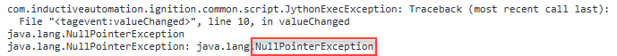

# Basic Logs Troubleshooting

Ignition generates a variety of logs that provide detailed information about errors, warnings, and system performance. This section outlines the different types of logs available, how to access them, and how they fit into the troubleshooting process.

## Types of Ignition Logs

Ignition offers multiple types of logs, each with a specific purpose.

- Vision Client
- Designer
- Gateway Status Page
- Gateway Wrapper
- Browser Console

### Vision Client Logs

- Used to debug Client-side issues in Vision resources.
- You can access it through the Vision Client diagnostics popup.
- Use the **CTRL+SHIFT+F7** shortcut to open the diagnostics popup if the **Hide Menu Bar** option within Project Properties is enabled.
- See also:[Vision Client Logs Diagnostics](https://www.docs.inductiveautomation.com/docs/8.1/ignition-modules/vision/vision-client-interface#diagnostics-popup---vision-client-logs)

### Designer Logs

- Used to debug and monitor issues during project development.
- You can access it through the Console tab in the Designer diagnostics.
- See also:[Designer Diagnostics Console Tab](https://www.docs.inductiveautomation.com/docs/8.1/platform/designer/designer-diagnostics#console-tab)

### Gateway Status Logs

- Used to monitor overall health of the Gateway.
- Shows errors related to Gateway events such as database or device connections, authentication profiles, Alarm Journals, and pipelines.
- You can access it through the **Gateway Webpage > Status > Logs**.

#### System_logs.idb

The system_logs.idb is the raw data file being directly referenced by the Gateway Status page. The Gateway stores logs in this file, and shows them on the **Gateway > Status > Logs** webpage. 

### Gateway Wrapper Logs

Wrapper logs are stored in a plain text format, making them much easier to read and open in your preferred text editor. Unlike the system_logs.idb, they don’t require a database browser like SQLite or querying tables to view. Wrapper logs also include all of the information from the system_logs.idb, plus additional logs from the Java Wrapper Service. These logs are useful for diagnosing problems about the Gateway not starting or restarting unexpectedly. You can’t view wrapper logs in the web interface, since they are accessed from the computer’s file system.

- **Windows**: C:\Program Files\Inductive Automation\Ignition\logs
- **Linux/Mac**: /usr/local/bin/ignition/logs
- See also:[Wrapper Logs](https://www.docs.inductiveautomation.com/docs/8.1/platform/gateway/status/diagnostics-logs/wrapper-logs)

### Browser Console Logs (Perspective Troubleshooting)

Browser console logs are essential when diagnosing Perspective projects. These logs show JavaScript errors, resource loading failures, and warnings that are specific to Perspective. To view these logs:

- **[Chrome](https://developer.chrome.com/docs/devtools/console/reference#open)****/****[Firefox](https://firefox-source-docs.mozilla.org/devtools-user/browser_console/index.html#opening-the-browser-console)**: Right-click > Inspect > Console tab

Note: If the issue occurs only in the[Perspective App](https://www.docs.inductiveautomation.com/docs/8.1/ignition-modules/perspective/perspective-sessions/ignition-perspective-app) and not in a browser, you can also review the[Perspective App logs](https://support.inductiveautomation.com/hc/en-us/articles/36183777105933-Troubleshooting-the-Perspective-Mobile-App#Look-at-the-Perspective-App-Logs). These logs are mainly useful when troubleshooting issues that are specific to the app. 

## Setting Logging Levels

Logging levels determine how much detail is captured. The following logging levels are available:

- **ERROR**: Critical issues
- **WARN**: Warning messages
- **INFO**: General system activity
- **DEBUG**: Detailed debugging info
- **TRACE**: Most detailed logging; used for deep troubleshooting

### Setting Logging Levels for Each Type of Log

- Vision Client Logs
    - Accessed and set through the Logging Levels tab of the Vision Client Diagnostics popup
    - See also:[Vision Client Logs Diagnostics](https://www.docs.inductiveautomation.com/docs/8.1/ignition-modules/vision/vision-client-interface#logging-levels-tab)

- Designer Logs
    - Accessed and set through the Logging Levels tab on the Designer Diagnostics popup
    - See also:[Designer Diagnostics Console Tab](https://www.docs.inductiveautomation.com/docs/8.1/platform/designer/designer-diagnostics#logging-levels)

- Gateway Wrapper and Status Logs
    - Accessed and set through the Settings icon on the **Gateway** > **Status** > **Logs** webpage, or with[Logback.xml](https://docs.google.com/document/d/1t7SSdMQaSzmxbf6CNaBtq2uqFdT50vh5bHdueelYsEs/edit?tab=t.0#heading=h.9w6ekihk9oqp)
    - See also:[Diagnostics Logs - Changing Logging Levels](https://www.docs.inductiveautomation.com/docs/8.1/platform/gateway/status/diagnostics-logs#changing-logging-levels)

### How to Know What Loggers to Set?

See the Ignition Logger Reference page for the most commonly used troubleshooting loggers:[Ignition Logger Reference](https://support.inductiveautomation.com/hc/en-us/sections/4413062918157-Loggers) 

Under the **Gateway >** **Status > Logs** page, you can review log entries,[adjust logger settings](https://www.docs.inductiveautomation.com/docs/8.1/platform/gateway/status/diagnostics-logs), and reproduce errors to capture more detailed information for troubleshooting. 

The following example provides an overview of how to use the logs for effective troubleshooting.

1. **Reproduce the Error**  
    Trigger the part of the subsystem that’s causing trouble. Look in the logs for messages    under the **ERROR** level. These often point directly to the source of the issue. 

1. **Set the Logger to Trace**  
    Once you identify which logger is logging the error, go into the logger settings and set that specific logger to **TRACE**.

1. **Reproduce the Issue**  
    Now that **TRACE** is enabled, try to trigger the issue again. You’ll likely get more information, and sometimes even about other related problems too. 

If all else fails, please reference the forums or Support for help.

### Configuring Logback.xml

Logback.xml is a configuration file for customizing Wrapper Logs and system_logs.idb.

- Controls how and where logs are stored.
- Allows you to tune the configuration of log behavior.
- See also:[Logback Migration Guide](https://support.inductiveautomation.com/hc/en-us/articles/4420375030029-How-To-Migrate-the-Ignition-Loggers-using-Logback-XML)
- See also:[Logback.xml Reference](https://www.docs.inductiveautomation.com/docs/8.1/appendix/reference-pages/logback-xml-file-reference)

### How to Read a Stack Trace

- Start from the **bottom up**.
- Look for **caused by** because this is usually the root cause. 
- Focus on **com.inductiveautomation** lines related to the subsystem. 

#### Error Types

Different errors fall into general categories, which can help guide where and how to troubleshoot.

- **User Errors**: 
    - Common errors: TypeError, trial expired
    - Caused by misconfigured scripts or actions.
    

- **Software Errors**: 
    - Common errors: NullPointerException, ClassCastException
    - Often internal bugs or misused APIs.
    

- **Network Errors**: 
    - Common errors: Connection timed out, connection refused
    - Most of these issues are user/environment related.
    

### Helpful Tools for Log Analysis

- **SQLite DB Browser**: Open and explore .idb log files like system_logs.idb.

- **Kindling**: Open, explore, filter, and search all the different log types mentioned in this manual. 

- **Notepad++(or other text editors)**: Open and edit .log and log .txt files. Notepad++ is commonly used and includes features like regular expression filtering, syntax highlighting, and directory wide search. 
