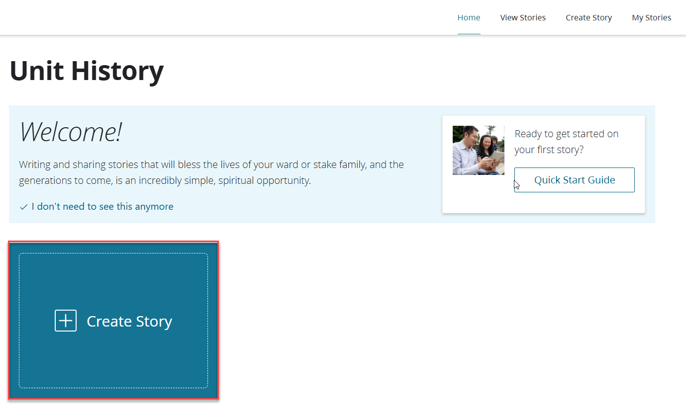
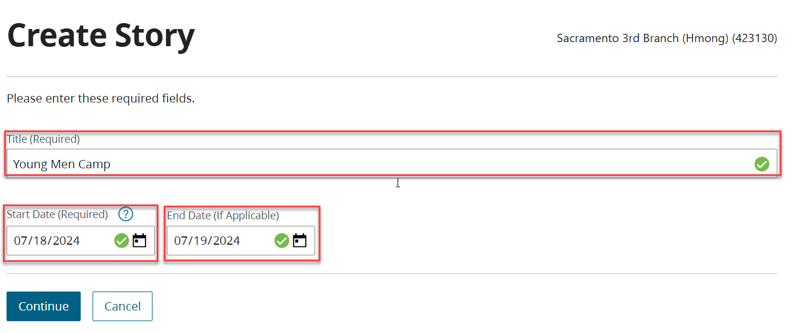
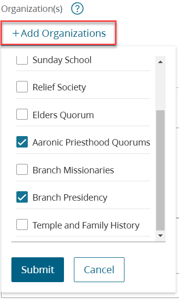
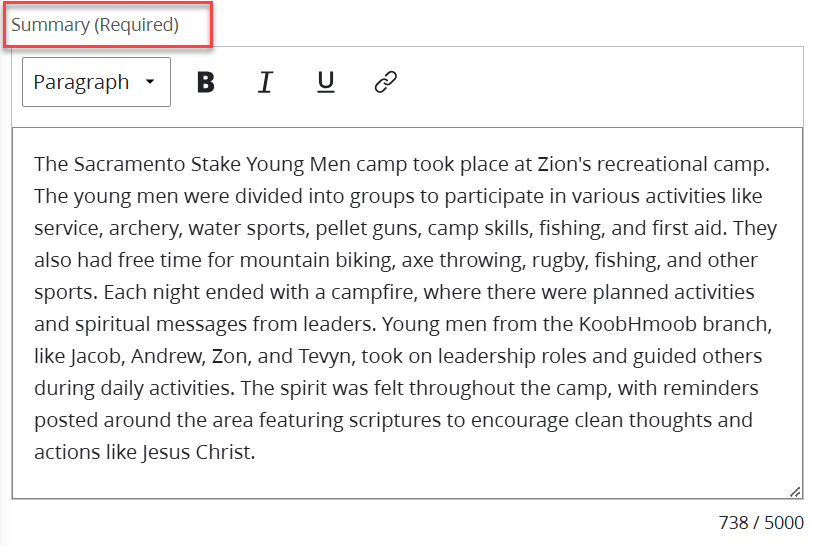
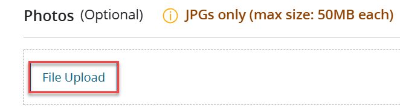
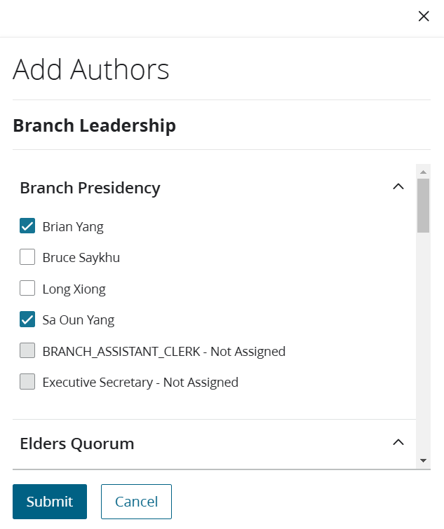

# How to create a story using the Unit History tool

The Unit History tool allows leaders to write and review stories, which are then visible online to members of the same ward or stake. These stories are saved and archived automatically. Submitting these histories fulfills the Lord's charge to record important events of the church and stewardship. The following step below will help you create a story.

1. Click on this [Link](https://unithistory.churchofjesuschrist.org/?lang=eng) and login by using your lds.org username and password.

2. Click on **Create Story**.

3. Fill in the **title, start date, end date**, and click on **continue**.

4. Add an **organization(s)** and click **submit**.

5. Write a **summary** about the event

6. Add photos and documents(optional) by using the **file upload** button.

7. You can use the **Add Author** button to add a user to edit your story. Click on submit.

8. Click on **Preview **to review your story, and then click on **Approve and Publish** or **Save and Close**. 

You have now created a story. You can view other stories, create stories, or review your stories by using the clickable tab on the top right hand corner.

